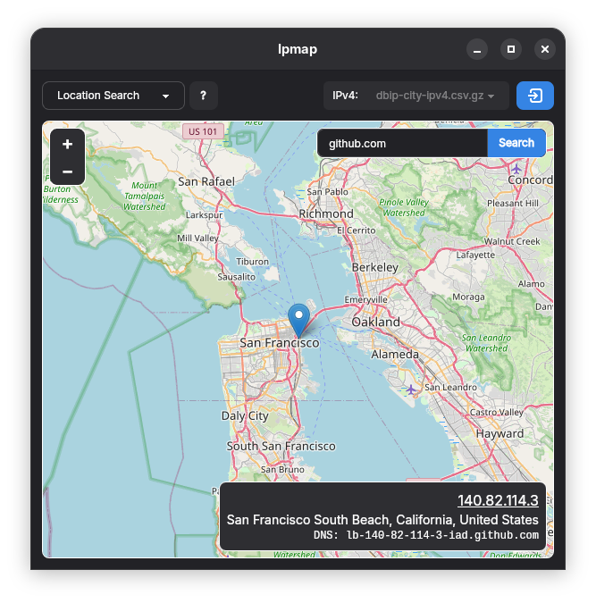
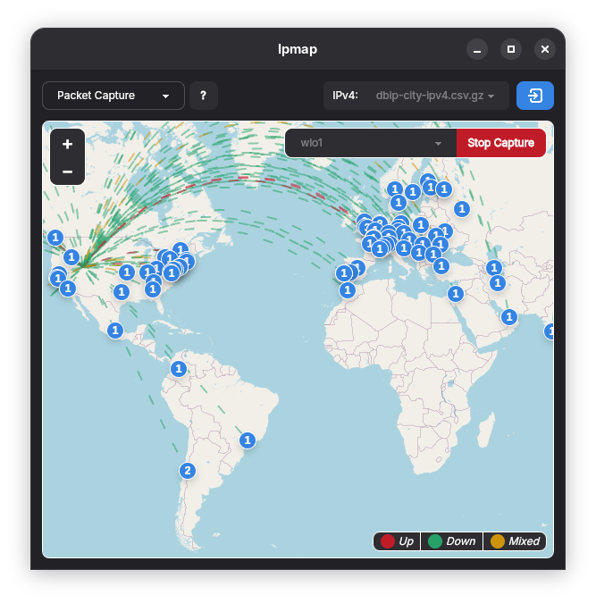
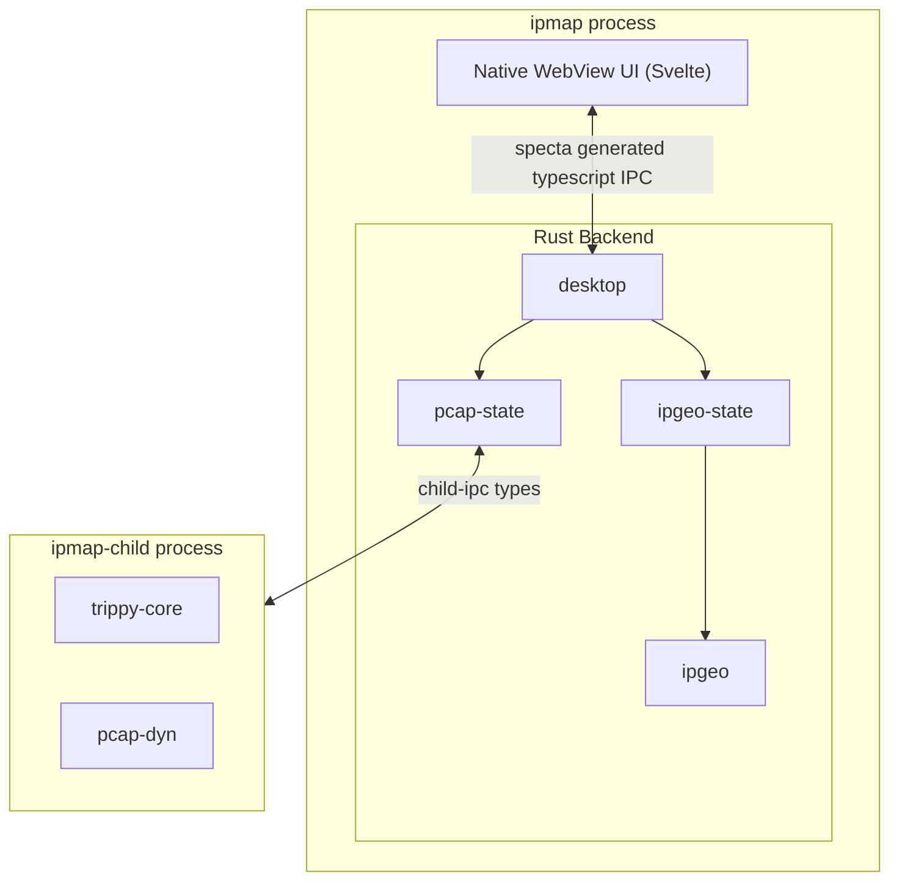

# Ipmap

A GUI viewer for [`saphics/ip-location-db`](https://github.com/sapics/ip-location-db?tab=readme-ov-file#city) ip-geolocation databases, which can display your computer's live network traffic and perform trace routes.

| Search                              | Capture                               | Traceroute                                  |
| ----------------------------------- | ------------------------------------- | ------------------------------------------- |
|  |  |  |

## Requirements
On Linux, install [webkitgtk](https://repology.org/project/webkitgtk/versions).

### Packet Capture
 - On Linux, install [`libpcap`](https://repology.org/project/libpcap/versions).
 - On Windows, install [Npcap](https://npcap.org) with network capture for non-administrator users.
 - On MacOS, `libpcap` is already installed.

### Traceroute
On Windows, you must enable a firewall rule to send ICMP packets for the traceroute feature.

```powershell
New-NetFirewallRule -DisplayName "ICMPv4 Ipmap Allow" -Name ICMPv4_IPMAP_ALLOW -Protocol ICMPv4 -Action Allow
New-NetFirewallRule -DisplayName "ICMPv6 Ipmap Allow" -Name ICMPv6_IPMAP_ALLOW -Protocol ICMPv6 -Action Allow

Enable-NetFirewallRule ICMPv4_IPMAP_ALLOW
Enable-NetFirewallRule ICMPv6_IPMAP_ALLOW
```

## Source Contents
 - `/crates`
    - `/desktop` - The main program entrypoint, starts tauri and generates Typescript IPC types.
    - `/ipgeo` - Data structures for representing ip-geolocation databases.
    - `/ipgeo-state` - UI state and methods for loading and switching ip-geolocation databases.
    - `/pcap-dyn` - Dynamic bindings to the [`libpcap`](https://www.tcpdump.org/) C library, modeled after the [`pcap`](https://crates.io/crates/pcap) crate.
    - `/pcap-state` - UI state and methods for executing `ipmap-child`.
    - `/child` - A separate child process (`ipmap-child`) for executing privileged features such as packet capture and traceroute.
    - `/child-ipc` - Shared types between `pcap-state` and `ipmap-child` for IPC.
 - `/ui` - The desktop UI, written with Svelte and Typescript.


