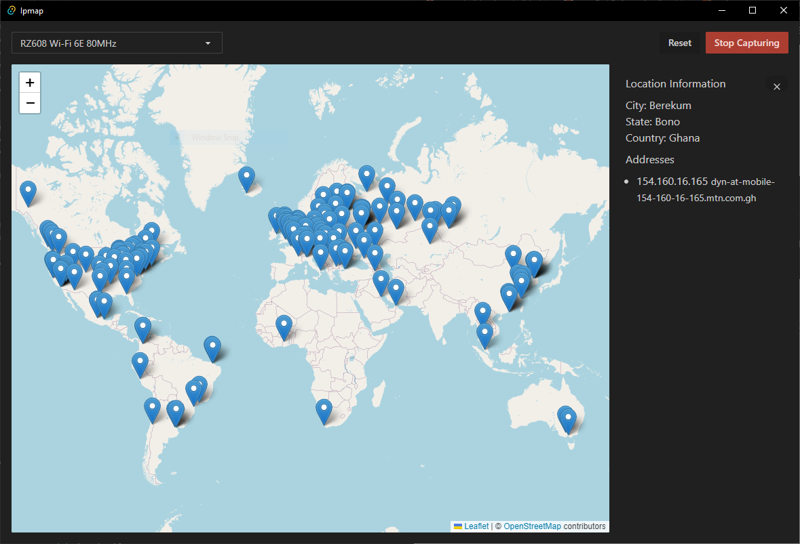

# ipmap
A map that displays connected IP addresses



 - https://github.com/sapics/ip-location-db
 - https://npcap.com/

Variables for building:
 - `IPV4NUM_DB`: The path to the built-in ipv4-num.csv database (optional)
 - `IPV4NUM_DB_ATTRIBUTION`: The copyright message for that database (required if `IPV4NUM_DB` set)

(Example)
```shell
$ IPV4NUM_DB="/path/to/dbip-city-ipv4-num.csv"
$ IPV4NUM_DB_ATTRIBUTION="IP Geolocation by DB-IP"
```