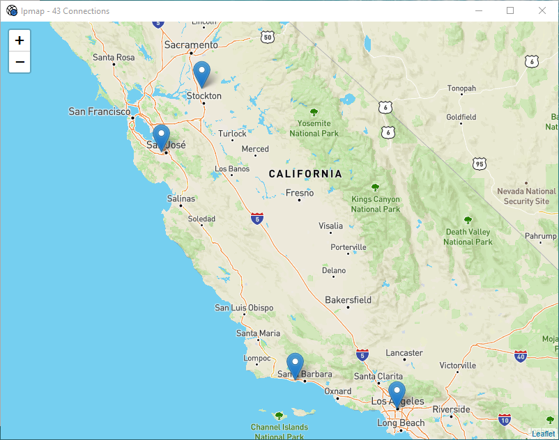
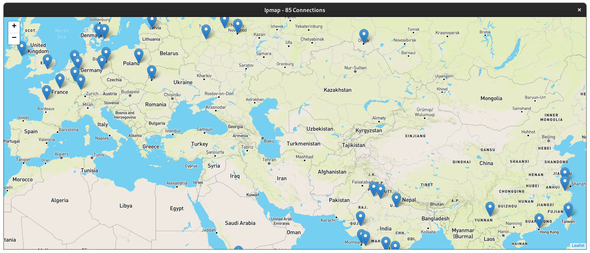

# ipmap
A map that displays connected IP addresses.

# Installation
## Windows
Installers will be available for Windows upon release 0.2.1.

If you're compiling it on your own you need `npcap` for packet capture and the Windows SDK for the interface.

## Linux
AUR packages will be provided upon release 0.2.1, until then there's a pkgbuild for `ipmap-git` in the [pkg directory](./pkg/).

If you're compiling it on your own you need `libpcap` for packet capture and `webkit2gtk` for the interface.

## Mac OS X
MacOS is still a work in progress, I will be making DMG files so you can easily use it without using the raw executable.

# Operation
Once the window opens, it should take a few seconds for the pins to start appearing on the map, you can zoom in to try to provoke it into adding some from the openstreetmap servers.

You can get the name of the city and the ip of a marker by either right or left clicking on the marker (depends on your operating system).

Keyboard Shortcuts:
- <kbd>f</kbd> - Toggle fullscreen
- <kbd>q</kbd> - Quit the window
- <kbd>c</kbd> - View credits

# Testing
If you really want to see it go crazy just download a torrent for a few seconds. The ip geolocation API service will rate limit you to 100 new markers per minute though before falling back on one that limits you monthly.
